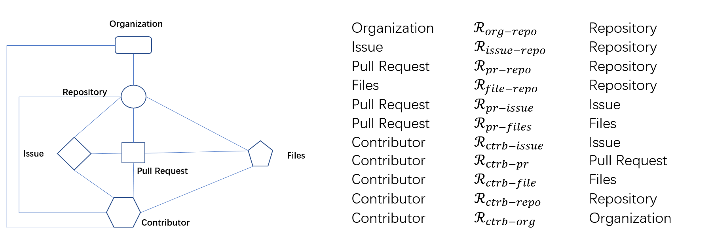
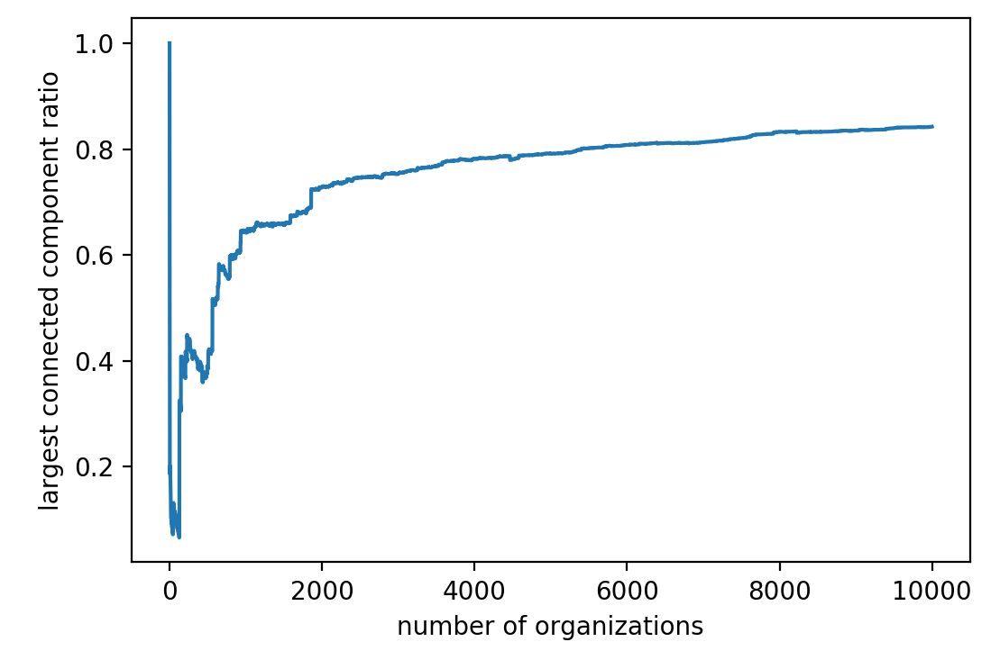
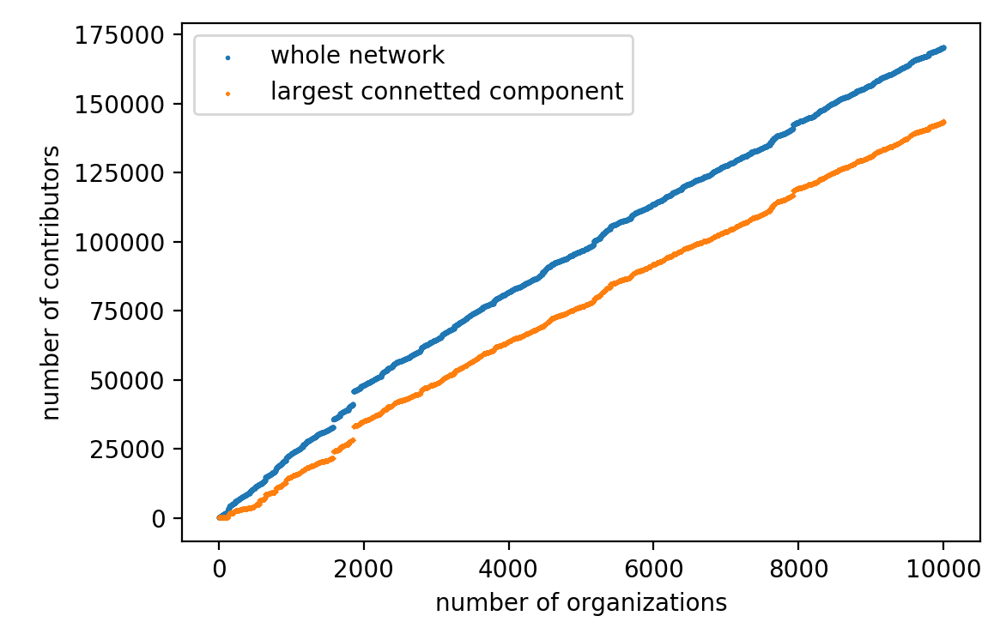
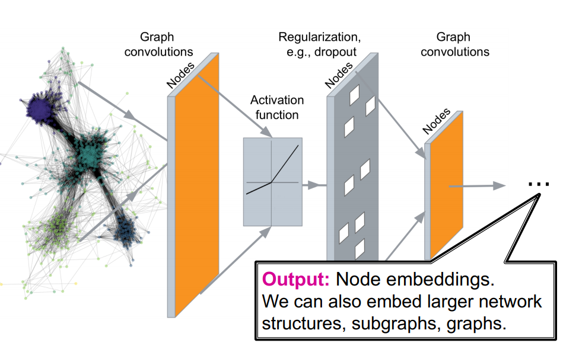

# Open Source  Communities: In the view of complex network

This project is mainly focused on networks analysis on GitHub platform.  I take all activities happened on GitHub as a process of swarm collaboration.  Contributors  collaborate with each other to develop knowledge in hundreds and thousands open source communities. As contributors can transfer from different communities，there is an invisible heterogeneous network  that connect all contributors and repositories on GitHub though collaboration relationship.  This project try to construct this network based on massive GitHub trace data and reveal properties of this "GitHub network". 

This project contains some  network experiments conducted on cleaned datasets.  

### Architecture

> csv	-----------------------------------------------------------# csv datasets
>
> > high_degree_nodes_list.csv -----------------------------# actors with degree more than 10						
> >
> > 2019_Top10000_org_pr_bipartite_network_edges.csv---# network edges list
> >
> > 2019_Top10000_org_pr_bipartite_network_nodes.csv--# network nodes list
> >
> > actor_list.csv-----------------------------------------# actors who interact with pull requests on GitHub
> >
> > top100000_org.csv-----------------------------------# Top 100,000 organizations
> >
> > high_degree_user_information.csv--------------------#contributor profile
> 
> notebooks -----------------------------------------# network experiments
>
> > data_selection.ipynb
>>
> > random_network_experiment.ipynb
> >
> > pr_net_GNN.ipynb
> >
> 
> static ------------------------------------------------# pics and experiment results

### GitHub Heterogenous Network Schema

The heterogeneous network schema is showing below.  There are 6 objects (nodes) in this schema,  namely *organization*, *repository*, *issue*, *pull request*, *contributors*,  *files*. Each pair of nodes can be connected through corresponding meta relation.  For organizations we care about, we can get the network instance which contains different semantics according to the network schema and corresponding meta relations.  This project focused on mate relation ***"organization-repository-PR-contributors"*** .

### Data Source

The data source for building networks from Augur database and GitHub Archive project.

### Data Selection 

There are over 50 million repositories on GitHub. In order to make experiments feasible, in first step we need select  repositories for building networks.  We know that there are many toy projects on GitHub, commonly one contributor push the repository to GitHub and no more activities happened since then. As we care about the swarm collaboration process in open source communities, we need to identify those repositories with high activity and bring a lot of contributors.  Those repositories belongs to different organizations. We rank those organizations according to their activity score and chose Top *K*  organizations to conduct experiments.  ***notebooks/data_selection.ipynb***  gives the detailed code for this procedure.  

The figure showing below illustrates Top 1,000 organizations on GitHub. We first calculate the activity score for a single repositories according to the GitHub event log data in 2019. Then we group  those repositories by their organization name and simply sum the score of each repository.  The red line indicate the number of repositories of each organization whereas the blue line indicate the sum  activity score of corresponding organization. 

### Pull Request-Contributor Network

As a illustration in this project, I just construct the networks based on the ***"organization-repository-PR-contributors"***  meta relation in our  heterogenous information network schema defined above.  We build our networks within the Top 10,000 organizations. ***notebooks/random_network_experiment.ipynb*** gives details of this experiment. In this experiment, we build the network with random selection. This network start with a randomly selected organization and add other organizations one by one,  until all organizations are merged in to the network. In this way, we can observe how the network growths.  

If we project the whole network with the contributor node set, we can get a simple contributor network contains collaboration patterns based on pull request of those organizations. The pictures showing below gives the largest connected component ratio and the number of contributors of  the growing contributor network.  It's clear that with more and more organizations get involved in the network, the number of contributors growth almost linearly and most of them connected with each other in a large network. They are not isolated with each other. We also show that the network average node degree converges to about 7 with the network growths bigger.

***2019_Top10000_org_pr_bipartite_network_edges.csv*** and ***2019_Top10000_org_pr_bipartite_network_nodes.csv*** is the whole bipartite network constructed with the Top 10,000 organizations. There are about 140,000 repositories get involved and millions of nodes in this network dataset. 

### Social science in open source

For contributor node, there are collaboration patterns can be represented by bipartite network. Then we can get the collaboration networks contains different relation semantics. For example,  contributor network is generated from the ***PR-contributors*** meta relation showing above.  With this network instance,  we can identify those hub nodes, namely nodes with high node degrees.  Those nodes means that they play an important roles in the open source communities. When new knowledge needs to flow back and merged into the main branch. Those people are responsible to ether generate new knowledge or check the contents.  The network node degree distribution shows that it subject to the power low distribution. The upper bound of the node degree in contributor network is 10^3. This may indicate the capacity  of the swarm collaboration process. For further research, we select those contributors with relatively higher node degrees ( node degree>= 10) in our network instance.  We get the a list contains about 23,000 contributors' ID. We then collect those contributors' information through GitHub API. Most of those contributors have their name information in their GitHub profile page. So we could use this to infer their gender.  The result shows that in the total contributor set (18342) that can be computed by the gender computer, their are 18064 contributors are male.

###  Learning Network Representations

Graph Neural Networks (GNNs) are an effective framework for representation learning of graphs. GNNs follow a neighborhood aggregation scheme, where the representation vector of a node is computed by recursively aggregating and transforming representation vectors of its neighboring nodes.  In our PR-contributor network instance, we have two type of nodes: pull request and contributors. Each pull request contains many features(text messages, number of contributors, labels, etc). We can take those different type of information  as a pull request node's representation vector. ***pr_net_GNN.ipynb*** give a example for learning pull-request network embeddings using ***Node2Vec*** method. The network use in this experiment is constructed from ***Augur*** database. There are about 3,000 repositories belonging to 13 different organizations in this database. We label each pull request node with the organization group id. The node features for each pull request node is generated from the  text massage with ***TF-IDF*** methods. More powerful NLP techniques like ***Word2Vec*** can essentially substitute the node feature computing block to generate more representative feature vectors.

### How to work with heterogeneous Networks

As what we show in our GitHub heterogenous information network schema, if we directly generate the network instance  with this schema, we can only get a heterogenous network which contains several type of nodes and multiple relations. A simple network can only be generated from a network projection from heterogeneous network instance like our experiment showing before.  The reason is we can't define direct relation shape between same node type in GitHub data schema. How ever, network projections may introduce information lost in practice.  So the question is if it's possible to work with heterogeneous without  network projection.   Under the GNN framework, we can apply different aggregator to  to different type of edges and nodes to get the node embedding vectors which contains information from different neighbor nodes.

### At the end

I am still working on this project. Anyone who interest in this project can check my blog  on [Google Doc](https://docs.google.com/document/d/1xin-pDauXMEqYGYSi67g4536v40h89tUGPaQ7zlGHbo/edit). I will update this repository branch and share latest results of this project to the CHAOSS community.

I start a new project to share my database server to everyone who are interested in network analysis or other innovations on GitHub trace data. Please check out the [GitHub analysis report 2020](https://github.com/X-lab2017/github-analysis-report-2020) project and read the documentations to figure out how you can use it. Have fun with this! 

